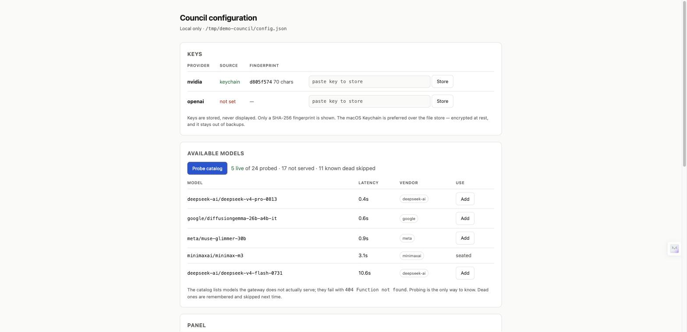
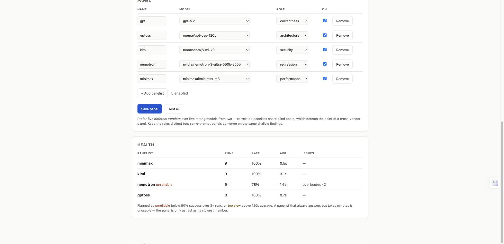

# claude-council

**Cross-vendor code review for Claude Code.** Send a diff to five different models at once — each
with a different review role — and get back consensus, disagreement, and a synthesis.

Works with **any OpenAI-compatible endpoint**: NVIDIA NIM, OpenAI, Together, OpenRouter, Zhipu, or
a local vLLM. No dependencies, no vendor lock-in, no CLI wrappers.



---

## Why bother

Every Claude subagent shares Claude's priors. A Claude-only review — however many agents you fan
out — cannot catch what Claude systematically misses. Neither can a single model reviewing its own
output.

The fix is **structural, not incremental**: ask models trained by different labs, on different
data, and give each a different question to answer.

When this project's council first reviewed its own source, it found **8 real defects**, including
a function whose docstring promised *"Never prints the key"* while printing 10 characters of it.
That bug was written by the same model that then failed to notice it. A different vendor caught it
in one pass.

## How this differs from other council plugins

The existing council plugins invoke **Codex CLI and Gemini CLI as subprocesses**. That design
choice cascades:

| | Other council plugins | claude-council |
|---|---|---|
| **Transport** | Spawns `codex` / `gemini` CLIs | Plain HTTPS to any OpenAI-compatible API |
| **Model choice** | Whatever those two CLIs support | Any model on any compatible gateway |
| **Free models** | No | Yes — NVIDIA NIM's free tier hosts DeepSeek, Kimi, Nemotron, MiniMax, GLM |
| **Setup** | Install 2 CLIs, authenticate each | Paste one API key |
| **Sandboxing** | Required — `sandbox-exec` profiles, pty wrapping, worktree snapshots | **Not applicable.** The models never touch your filesystem |
| **Config UI** | Config files | Local web UI with live model probing |
| **Reliability tracking** | None | Per-panelist health; flags failures *and* slowness, suggests replacements |
| **Dependencies** | Node, 2 CLIs, 2 auth flows | Python 3.9+ stdlib. That's it |

Credit where due: [`DantesPeak85/the-council`](https://github.com/DantesPeak85/the-council) and
[`yeameen/claude-code-review-council`](https://github.com/yeameen/claude-code-review-council) framed
the problem well — parallel advisors, synthesized verdict. This project keeps that shape and
replaces the transport, which is what limits which models you can seat.

Most of their code is sandbox machinery, and it exists for a good reason: an agentic CLI with
filesystem access genuinely needs containing. Send text to an HTTPS endpoint instead and the entire
category of risk disappears — along with the code that manages it.

## Install

```
/plugin marketplace add swingsystems/claude-council
/plugin install claude-council@claude-council-marketplace
```

Then `/council:setup`.

**Requirements:** Python 3.9+. No pip, no venv, no Node. Standard library only.

## Quick start

**1. Get a free NVIDIA key** at [build.nvidia.com](https://build.nvidia.com) → any model →
*Get API Key*. One key is account-level and works for every model in the catalog.

**2. Store it** (Keychain — encrypted at rest, stays out of backups):

```bash
security add-generic-password -a "$USER" -s nvidia-api-key -w
```

> The prompt is invisible — no dots, no echo. A paste that silently fails creates an **empty** item
> that looks exactly like success. Verify with `--diagnose-key nvidia`.

**3. Configure** — open the UI and pick your panel:

```
/council:config
```

**4. Review:**

```bash
/council:review
```

## The configuration UI



`/council:config` opens a local page: store keys, probe the catalog live, pick panelists, assign
roles, and read health. No hand-written JSON.

The server prints a URL containing a one-time token and opens your browser. Keep the terminal open
— it stops when that terminal closes or after 30 minutes idle.

**Live probing matters more than it sounds.** NVIDIA's `/v1/models` lists models the gateway does
not actually serve — they fail with `404 Function not found`. In the screenshot above, **5 of 24
probed models were live**; 17 were catalogued but dead. Probing is the only way to know, and dead
models are cached so they're skipped next time.

**Security posture**, since this opens a socket:

- binds `127.0.0.1` only, never `0.0.0.0`
- a random token is required on every API call and changes each run
- `Host` header is validated, defeating DNS rebinding
- the page sets a CSP and loads nothing external
- stops after 30 minutes idle
- keys may be submitted but are **never** returned — only SHA-256 fingerprints leave the server

## Roles

Nine ship by default: `correctness`, `architecture`, `security`, `regression`, `performance`,
`simplicity`, `data-integrity`, `product`, `generalist`.

**Distinct roles are the whole design.** Five models given the same generic *"review this"* prompt
converge on the same shallow findings. Five models given five *different* questions find five
different classes of defect. Edit `~/.claude/council/roles.json` to customize.

## Example

A real run against this project's own `cmd_configure`:

```
$ /council:review
```

```
PANELIST: kimi [security]                              33.4s
  cmd_diagnose_key leaks 10 characters of the API key to stdout.
  The docstring says "Never prints the key" — it does.
  Fix: print a sha256 prefix, or just the length.

PANELIST: nemotron [regression]                        97.3s
  cmd_diagnose_key ignores keychain_account from provider config
  and uses $USER, so it reports NOT FOUND for a secret that exists.

PANELIST: minimax [performance]                         8.4s
  cmd_show invokes one `security` subprocess per panelist, serially,
  each with a 10s timeout — contradicting the parallel design elsewhere.
```

Three vendors, three roles, three genuinely different defects. All three were real and all three
were fixed.

## Reliability

Health is recorded after every run at no extra cost.

```
PANELIST      RUNS    OK   RATE     AVG  ISSUES
gptoss           8     8   100%    0.7s  -
kimi             9     9   100%    3.1s  -
nemotron         9     7    78%    1.6s  overloadedx2  <-- UNRELIABLE
deepseek         6     1    17%  206.0s  timeoutx3     <-- TOO SLOW
```

Two independent failure modes, because they need different responses:

- **UNRELIABLE** — below 80% success over 3+ runs
- **TOO SLOW** — above 120s average. A panelist that always answers but takes minutes is unusable;
  the panel is only as fast as its slowest member

`--suggest-swap <panelist>` probes candidates, ranks by measured latency, prefers vendors not
already seated, and prints the exact command to apply. It never edits your config.

**Read the cause before swapping.** A slow panelist running `reasoning_effort: high` is usually a
bad setting, not a bad model.

## Commands

| Command | Does |
|---|---|
| `/council:config` | Open the web UI — keys, model probing, panel, roles, health |
| `/council:setup` | Same, guided conversationally instead of in a browser |
| `/council:review [target]` | Run a review and synthesize the results |
| `/council:health` | Reliability report with swap recommendations |

<details>
<summary>CLI reference</summary>

The script lives inside the installed plugin. To call it directly:

```bash
COUNCIL=$(echo ~/.claude/plugins/cache/claude-council-marketplace/claude-council/*/scripts/council.py)
python3 "$COUNCIL" --show
```

Or run it from a clone: `python3 scripts/council.py --show`.

```bash
council.py --serve                  # configuration UI
council.py --show                   # current panel and where each key resolves
council.py --check                  # liveness probe, ~8 tokens per panelist
council.py --health                 # reliability + recommendations
council.py --suggest-swap NAME      # probe replacements for a panelist
council.py --list-models            # authoritative model IDs from the API
council.py --list-roles             # available review roles
council.py --set-key PROVIDER       # store a key (reads stdin, never argv)
council.py --diagnose-key PROVIDER  # why a key does or does not resolve
council.py --configure              # write a panel from JSON on stdin
council.py --prompt-file PATH       # run a review
```
</details>

## Keys

Resolution order: **environment variable → macOS Keychain → `credentials.json` (mode 0600)**.

Keys are never written to `config.json`, never passed as command-line arguments (so they stay out
of `ps` and shell history), and never printed. Diagnostics report length and a SHA-256 fingerprint
only.

## Known gotchas

These cost real debugging time. They are provider behaviour, not bugs here:

- **`/v1/models` over-reports.** Catalogued ≠ served. Always `--check` after configuring.
- **Model IDs retire without warning** — `410 Gone` with an EOL date. Re-probe periodically.
- **`529` / `503` are transient** provider capacity, not your config.
- **OpenAI's newer models reject `max_tokens`** in favour of `max_completion_tokens`. Handled
  automatically — the client adapts from the provider's own error and retries once.
- **Panelists hallucinate.** Expect roughly 1 stale or wrong finding in 15. Always verify against
  the real file. Majority agreement is evidence, not proof — models trained on similar data are
  wrong together.
- **Scope reviews to a diff**, not a whole codebase.

## Layout

Plugin code and user data are separate directories, so upgrading never touches your keys.

```
claude-council/            ~/.claude/council/     (user data, never in the repo)
├── scripts/council.py     ├── config.json
├── defaults/              ├── roles.json         (optional override)
│   ├── roles.json         ├── credentials.json   (0600, only without Keychain)
│   ├── config.example.json└── health.json
│   └── ui.html
├── commands/
├── skills/council/
└── tests/
```

Override the data location with `COUNCIL_HOME`.

## Tests

```bash
python3 -m unittest discover -s tests -v
```

13 tests, fully offline — no network, no keys, no Keychain access.

## Contributing

Issues and PRs welcome. Useful contributions:

- **Provider adapters** — any OpenAI-compatible gateway should work; report ones that don't
- **Roles** — a well-written review lens is worth more than a feature
- **Model reports** — which models give genuinely useful review, and which pad

Please run the tests and keep the script dependency-free.

## License

MIT
